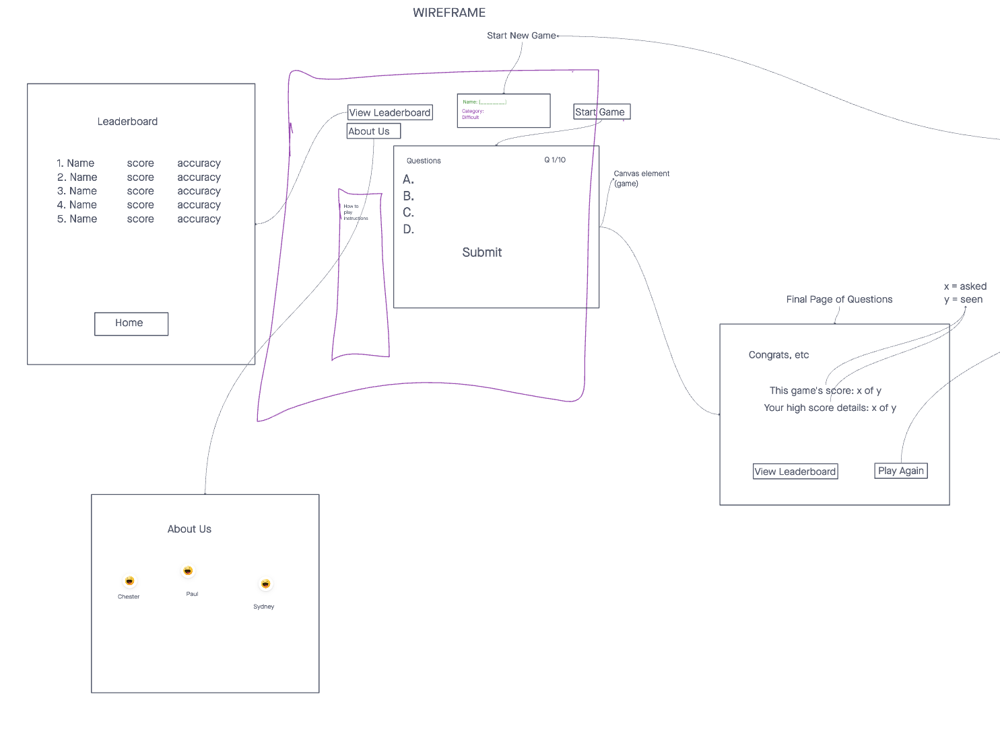
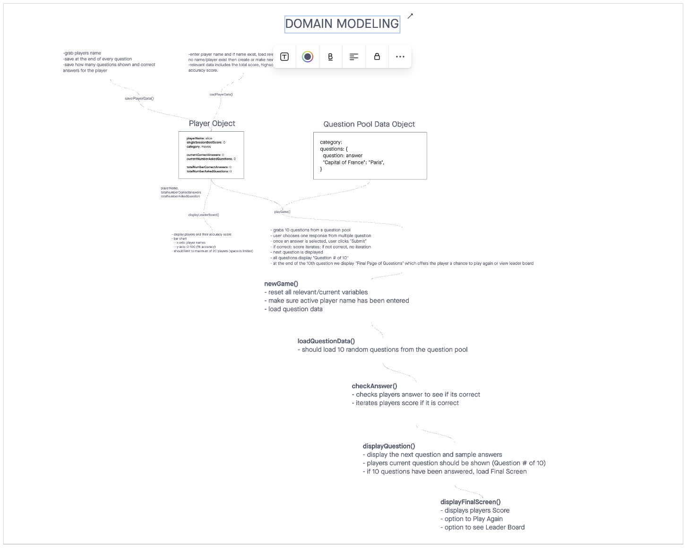
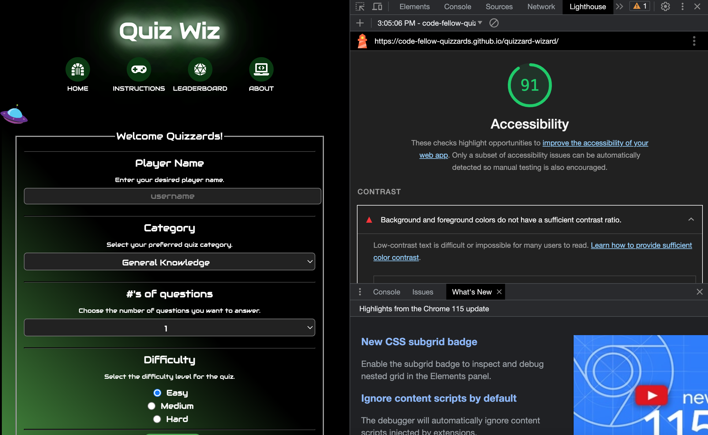

# Quizzard Wizard

## Team Members

- Chester
- Paul
- Sydney

> The ***Quizzard Wizard*** is a fun and engaging web application that challenges users with a wide range of exciting quizzes on various topics. Players can test their knowledge, compete with friends, and unlock achievements as they progress through levels. With a user-friendly interface and instant feedback, the quiz game provides an enjoyable way to learn and expand one's knowledge while having a great time.

## Wireframe

## User Stories
[GitHub Project](https://github.com/orgs/Code-Fellow-Quizzards/projects/1/views/1)

## Domain Modeling
> Our domain modeling can be found in our invisionapp sketch located here:
[Domain Modeling](https://projects.invisionapp.com/freehand/document/QUoxhvzef)

## Lighthouse

### References
- ChatGPT and other AI models were used to suggest, correct and explain code.
